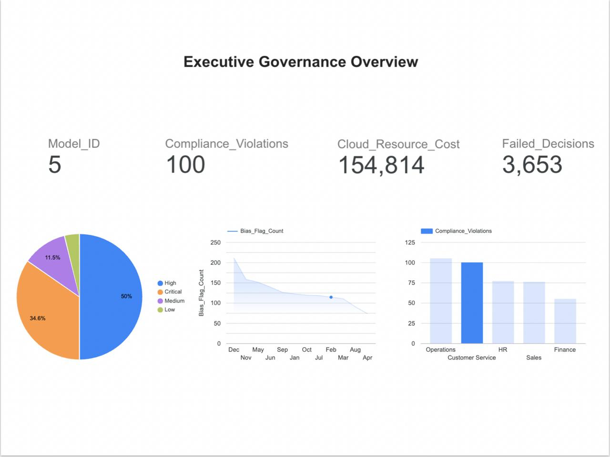
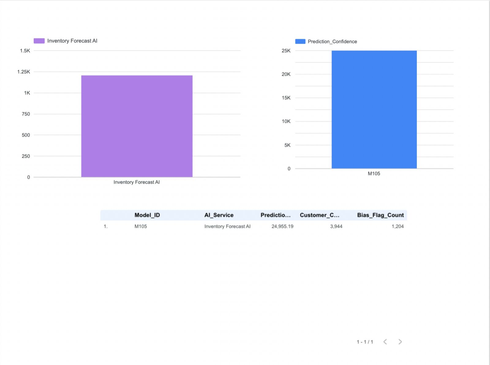
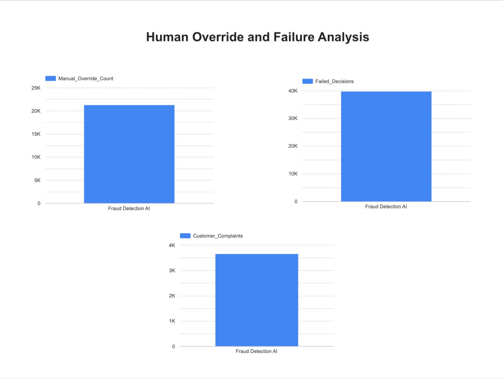
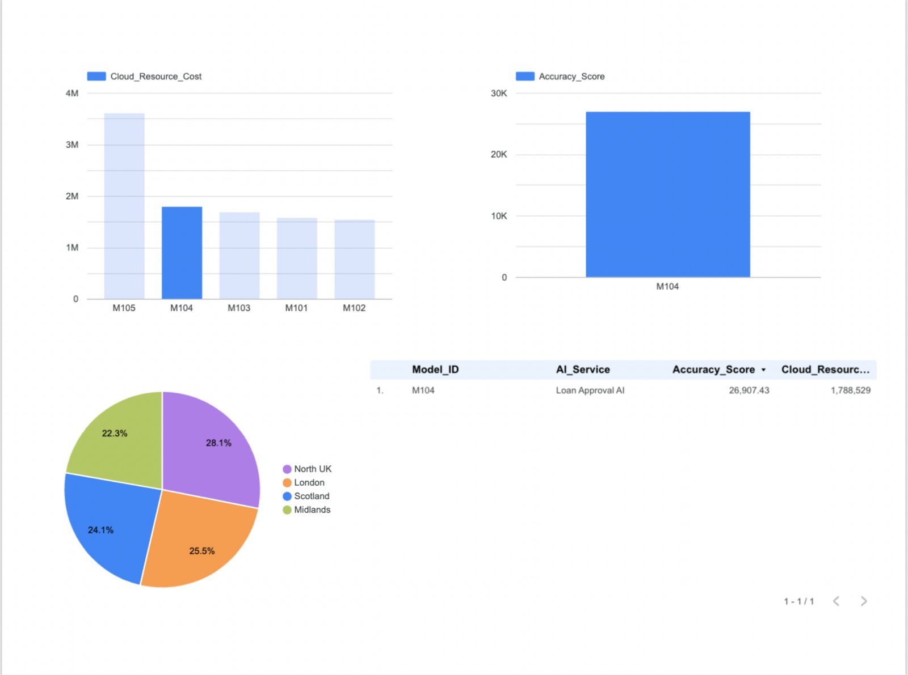
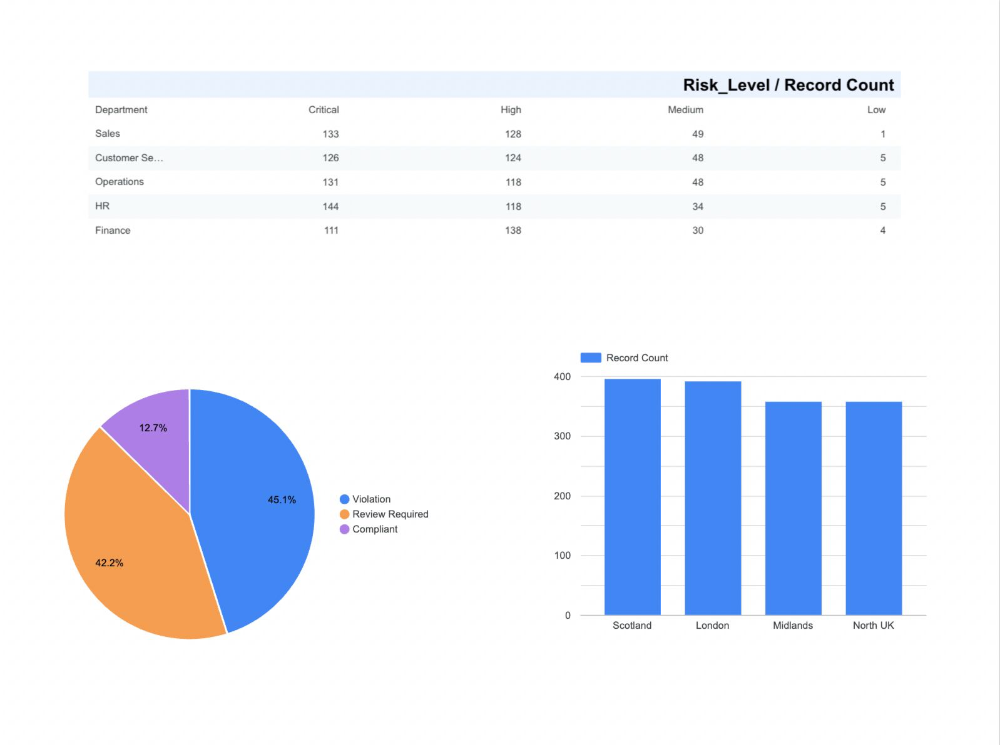

# AI Governance and Business Risk Monitoring Dashboard

## Overview
The AI Governance and Business Risk Monitoring Dashboard is an enterprise analytics solution designed to evaluate the operational accountability, fairness, compliance health, and cloud cost efficiency of deployed AI systems across multiple organizational departments.

As businesses increasingly integrate AI into recruitment, customer support, fraud detection, loan approval, and forecasting workflows, management requires a centralized mechanism to monitor:

- fairness and bias incidents,
- human override dependency,
- compliance violations,
- customer dissatisfaction,
- declining prediction confidence,
- failed automated decisions,
- and cloud resource expenditure.

This project provides an end-to-end analytical framework to govern those risks through SQL-driven backend analysis and executive dashboard visualization.

---

## Business Problem Statement

Organizations deploying AI systems often lack a unified oversight framework to answer critical business questions such as:

- Which AI services are generating the highest compliance exposure?
- Where are manual human interventions overriding automated decisions?
- Which models are expensive yet underperforming?
- How are fairness incidents trending over time?
- Which departments are carrying the highest operational AI risk?

The absence of AI governance visibility can lead to reputational, legal, financial, and operational inefficiencies.

This dashboard addresses that challenge by simulating enterprise AI monitoring logs and transforming them into actionable executive intelligence.

---

## Key Features

- Synthetic enterprise AI governance dataset with 1500+ monitoring records
- SQL-based backend analytical query engine
- Compliance and fairness incident monitoring
- Human override and failed decision tracking
- Cloud cost vs model performance intelligence
- Executive risk categorization by department and region
- Multi-page business dashboard for leadership reporting

---

## Technology Stack

- SQL (SQLite Relational Database)
- VS Code SQLite Query Environment
- Python (CSV to Database Pipeline)
- Google Data Studio / Looker Dashboard Visualization
- Google Sheets Synthetic Data Engineering
- GitHub Documentation Repository

---

## Dataset Schema

The project dataset `AI_Model_Governance_Log` contains the following enterprise attributes:

- Record_ID
- Month
- Model_ID
- AI_Service
- Department
- Transactions_Processed
- Accuracy_Score
- Prediction_Confidence
- Bias_Flag_Count
- Manual_Override_Count
- Customer_Complaints
- Compliance_Violations
- Cloud_Resource_Cost
- Avg_Response_Time
- Failed_Decisions
- Risk_Level
- Compliance_Status
- Region

---

## SQL Analytics Performed

The backend SQL analysis was designed to identify:

- Most expensive AI services by cloud resource usage
- Departments with maximum compliance issues
- AI workflows requiring frequent manual override
- Lowest confidence and highest complaint models
- Monthly fairness incident trends
- Critical risk records by geographical region
- High-cost underperforming AI models
- Customer complaints vs failed AI decisions
- Compliance status distribution
- Fairness ranking across deployed AI models

SQL query scripts are available in the `/sql` directory.

---

## Dashboard Pages

### 1. Executive Governance Overview
High-level KPIs summarizing AI model count, cloud spend, failed decisions, and compliance violations.

### 2. Fairness and Trust Monitoring
Bias incident analysis, prediction confidence comparison, and low-trust model identification.

### 3. Human Override and Failure Analysis
Tracks manual intervention dependency, AI failure volumes, and customer complaints.

### 4. Cloud Cost and Performance Intelligence
Evaluates expensive AI models, regional cloud spend, and model efficiency.

### 5. Executive Risk Matrix
Department-wise operational risk distribution and compliance health.

---

## Repository Structure

```bash
AI-Governance-Business-Risk-Monitoring-Dashboard/
│
├── data/
├── sql/
├── sql_query_outputs/
├── dashboard_screenshots/
├── docs/
└── src/
```
```text id="s3n7qd"
---

## Dashboard Preview

### Executive Governance Overview


### Fairness and Trust Monitoring


### Human Override and Failure Analysis


### Cloud Cost and Performance Intelligence


### Executive Risk Matrix


---

## Project Outcome

This project demonstrates the intersection of:

- AI governance
- responsible AI monitoring
- SQL analytics
- business intelligence
- cloud cost awareness
- executive risk reporting

It was built to simulate how organizations can move beyond AI deployment into AI accountability and operational oversight.

---

## Author

Nakshatra Kamat  
B.Tech Information Technology | AI & Business Analytics Enthusiast
